# 🌐 Online Job Portal

### 🛠️ Technologies Used:


---

## 📄 Project Overview:
The **Online Job Portal** is a web-based application that allows administrators to manage job listings and users to browse and apply for jobs. This application follows an MVC architecture and is built using modern web technologies for efficient performance and scalability.

## 🏛️ Project Architecture:
The project is segregated into **4 layers**:

1. **Controller Layer** 🖥️  
   - Handles HTTP requests and responses.

2. **Repository Layer** 💾  
   - Contains interfaces for performing database operations.

3. **Service Layer** ⚙️  
   - Implements business logic.

4. **Model Layer** 📂  
   - Contains entity classes representing tables such as `admin`, `user`, and `jobs`.

## 🌟 Features & Functionalities:

### 👤 Admin Features:
- ✅ **Add Jobs** - Post job listings with details.
- 🔍 **View Jobs** - See all listed jobs.
- ❌ **Remove Jobs** - Delete job listings.
- ✏️ **Edit Jobs** - Update job details.
- 📋 **View Profile** - Access admin details.
- ⚙️ **Edit Profile** - Update admin information.

### 💼 User Features:
- 📚 **Register** - Create an account.
- 🔑 **Login** - Secure user authentication.
- 🔄 **Password Reset** - Recover password using email/phone.
- 🏢 **Browse Jobs** - View and apply for job listings.
- 📂 **Manage Profile** - View and update user details.

## 🚀 Installation & Setup:
### Prerequisites:
- Java 8 or later
- MySQL Database
- Spring Boot
- Maven

### Steps to Run the Project:
1. Clone the repository:
   ```bash
   git clone https://github.com/yourusername/online-job-portal.git
   ```
2. Navigate to the project directory:
   ```bash
   cd online-job-portal
   ```
3. Configure the MySQL database in `application.properties`:
   ```properties
   spring.datasource.url=jdbc:mysql://localhost:3306/jobportal
   spring.datasource.username=root
   spring.datasource.password=yourpassword
   ```
4. Build and run the project:
   ```bash
   mvn spring-boot:run
   ```
5. Access the application at:
   ```
   http://localhost:8080
   ```

## 📷 Screenshots:
### 🔹 Home Page:


### 🔹 Registration Page:
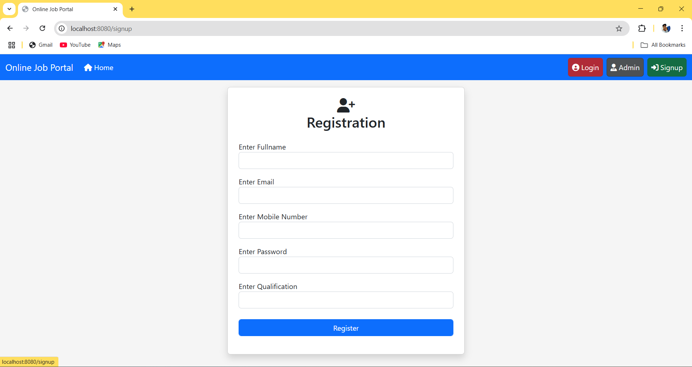

### 🔹 Login Page:
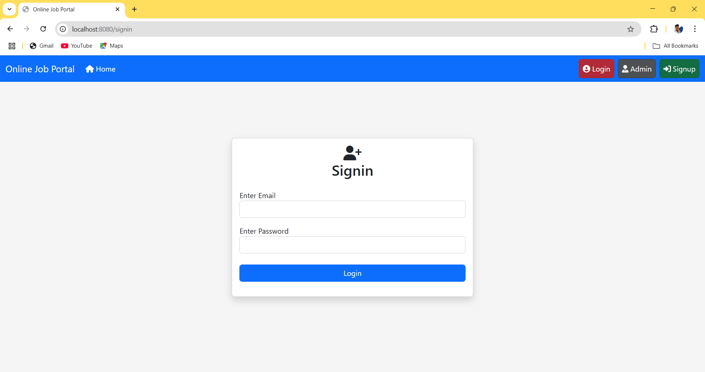

### 🔹 Forgot Password Page:
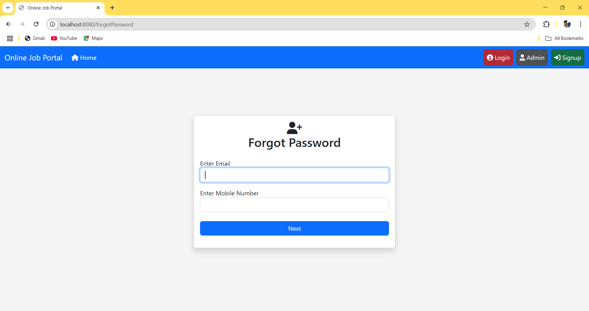

### 🔹 Change Password Page:


### 🔹 Admin Login Page:
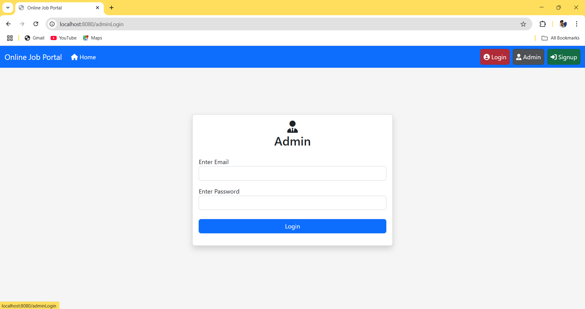

### 🔹 Admin Home Page:


### 🔹 Admin Profile Page:
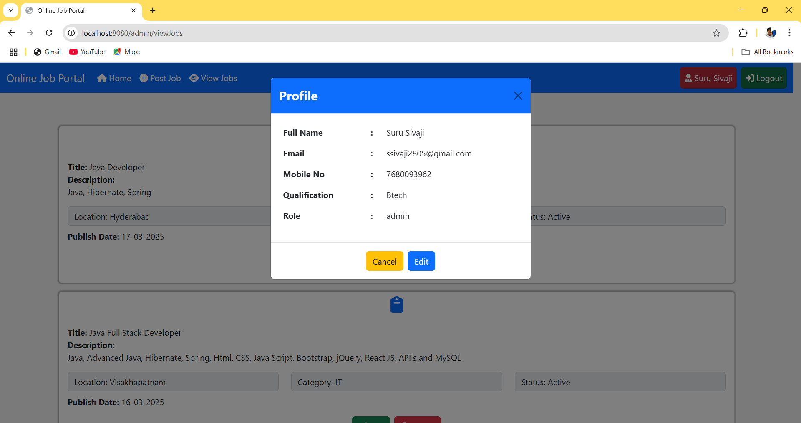

### 🔹 Edit Admin Page:
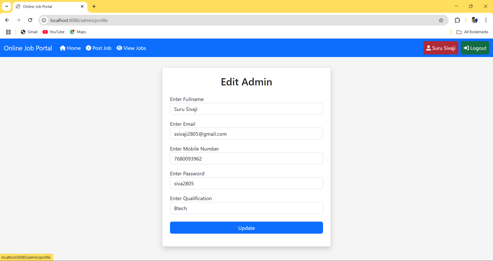

### 🔹 Add Job Page:
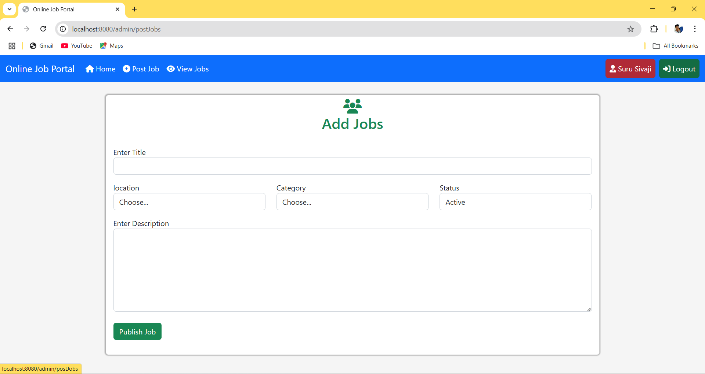

### 🔹 View Jobs Page:
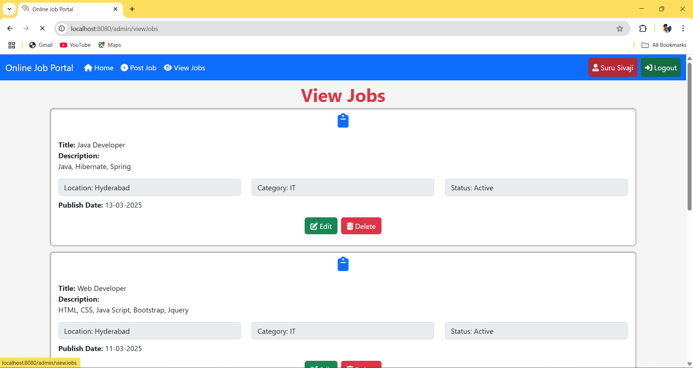

### 🔹 Edit Job Page:
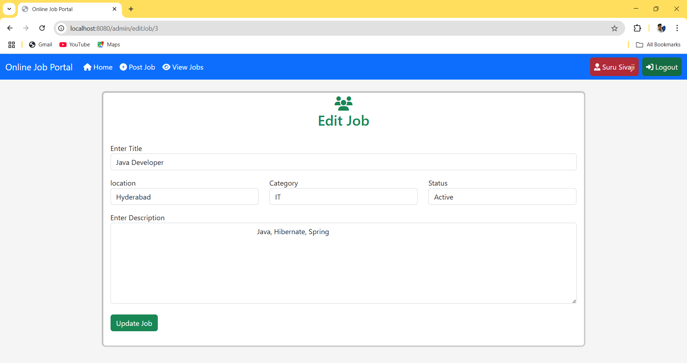

### 🔹 Delete Job Page:
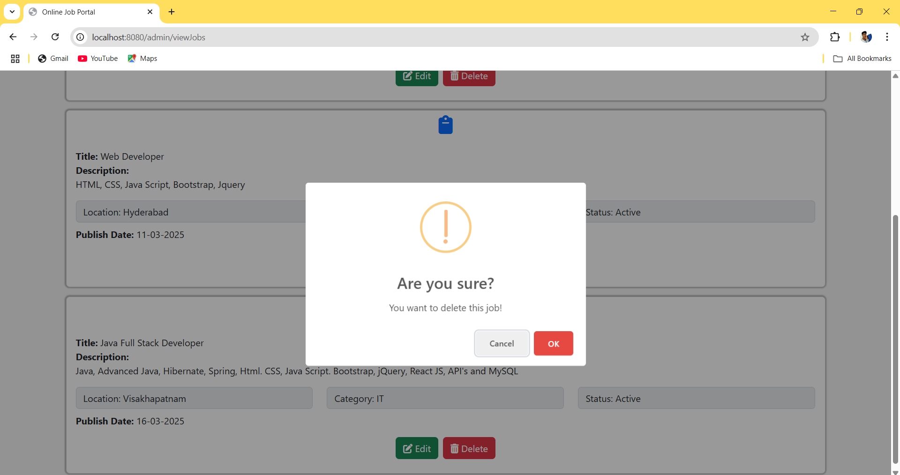

### 🔹 Admin Logout Page:
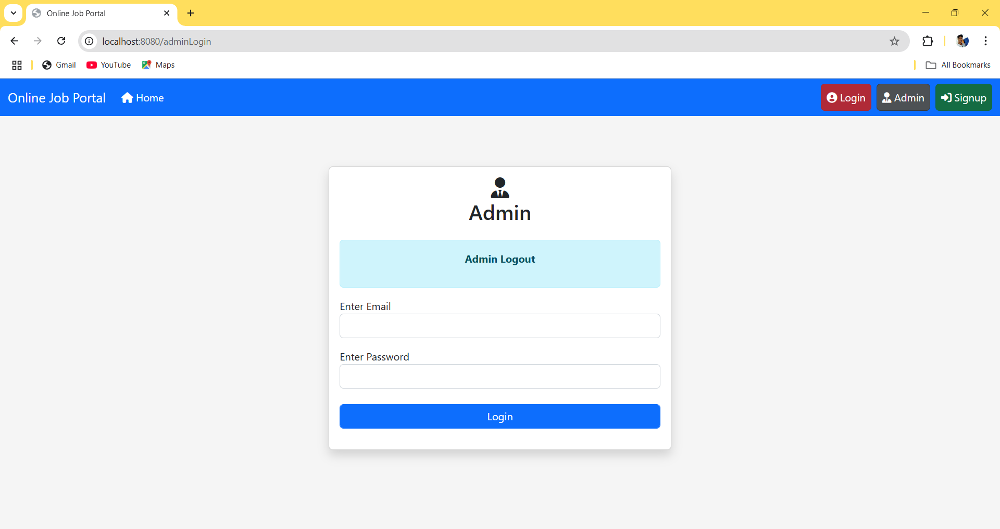

### 🔹 User Home Page:


### 🔹 View Profile Page:
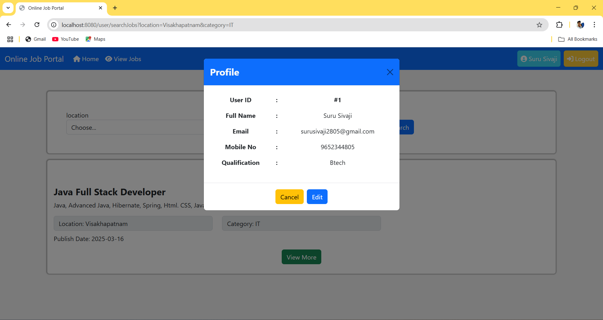

### 🔹 Edit Profile Page:
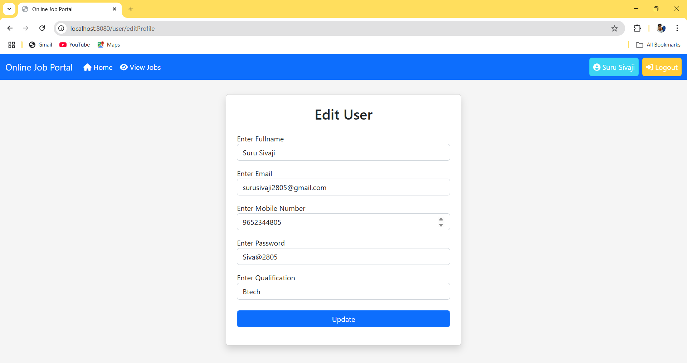

### 🔹 All Jobs Page:
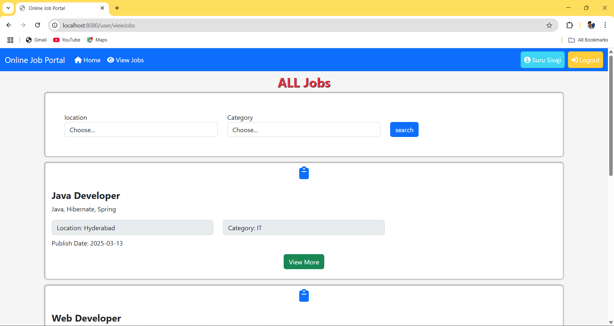

### 🔹 Search Job Page:
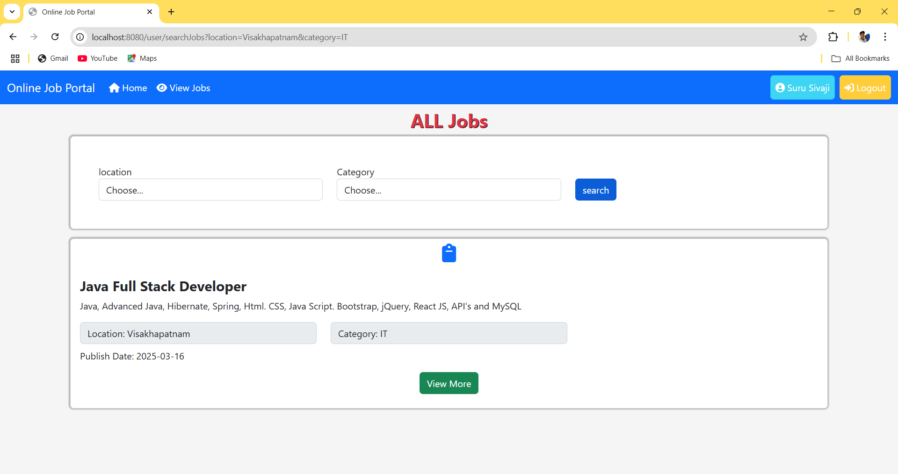

### 🔹 View Job Page:
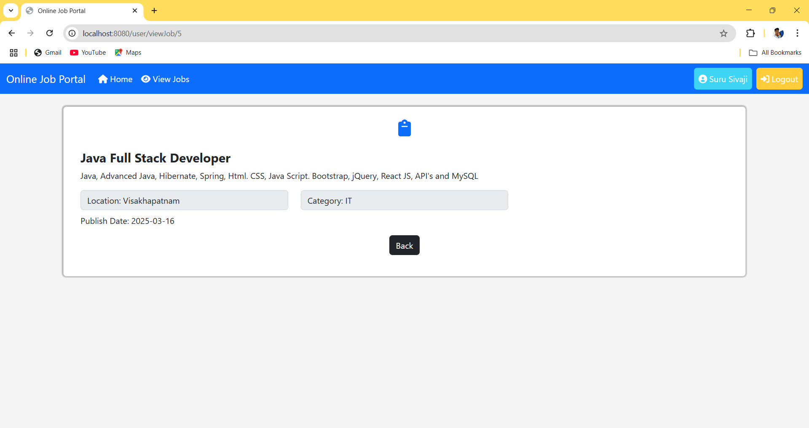

### 🔹 User Logout Page:
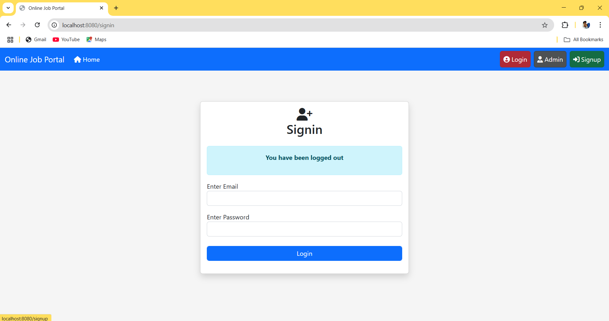

## 🤝 Contributing:
Feel free to raise issues or submit pull requests.

## 📜 License:
This project is **open-source** and free to use.

---
📌 Developed by **Suru Sivaji** 👨‍💻

