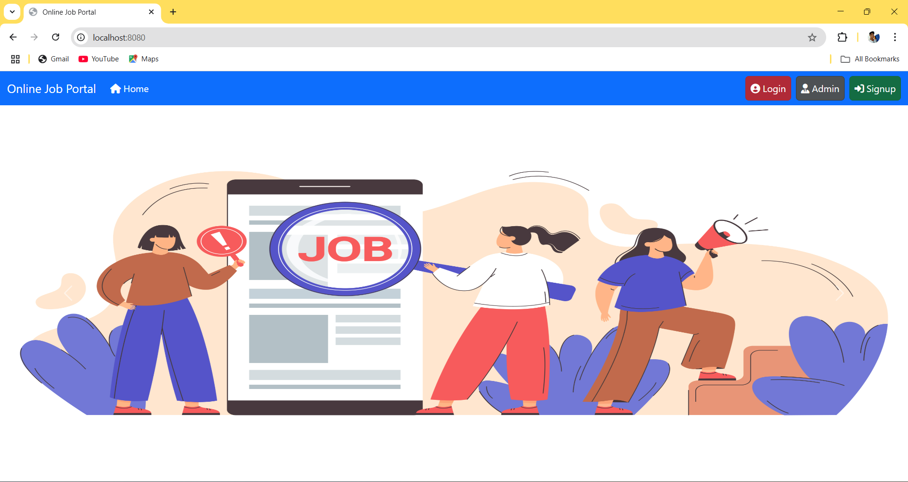
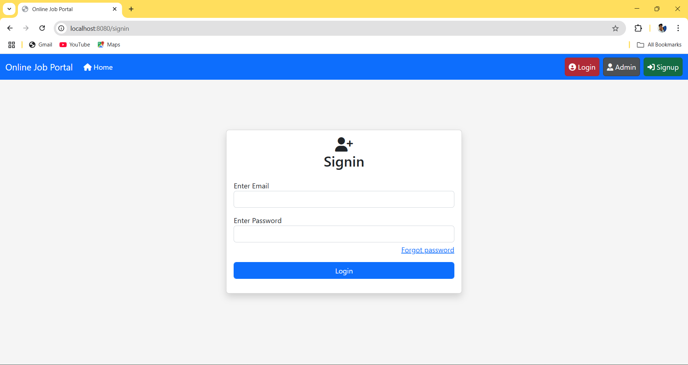

# 📌 Online Job Portal

### 🛠️ Technologies Used:
-  **Java**
-  **Spring Boot**
-  **Spring MVC**
-  **JSP**
-  **MySQL**
-  **Bootstrap**
-  **Spring Data JPA**

## 📄 Project Overview:
The **Online Job Portal** is a web-based application that allows administrators to manage job listings and users to browse and apply for jobs. This application follows an MVC architecture and is built using modern web technologies for efficient performance and scalability.

## 🏛️ Project Architecture:
The project is segregated into **4 layers**:

1. **Controller Layer** 🖥️  
   - Handles HTTP requests and responses.

2. **Repository Layer** 💾  
   - Contains interfaces for performing database operations.

3. **Service Layer** ⚙️  
   - Implements business logic.

4. **Model Layer** 📂  
   - Contains entity classes representing tables such as `admin`, `user`, and `jobs`.

## 🌟 Features & Functionalities:

### 👤 Admin Features:
1. **Add Jobs** - The admin can create and post new job listings by entering job details such as title, description, salary, and required skills.
2. **View Jobs** - The admin can see all the jobs listed in the system along with relevant details.
3. **Remove Jobs** - The admin has the ability to delete jobs that are no longer available or relevant.
4. **Edit Jobs** - The admin can update existing job listings by modifying details as needed.
5. **View Admin Profile** - The admin can view their personal details such as name, email, and contact information.
6. **Edit Admin Profile** - The admin can update their profile information, such as changing passwords or updating personal details.

### 👨‍💼 User Features:
1. **User Registration** - New users can sign up by providing necessary details such as name, email, phone number, and password. The data is securely stored in the database.
2. **User Login** - Registered users can log in using their credentials to access job listings and manage their profiles.
3. **Password Reset** - If a user forgets their password, they can reset it using their registered email and mobile number.
4. **View Jobs** - Users can browse available job listings and see details such as job descriptions, salary, and required qualifications.
5. **View User Profile** - Users can see their personal details, including their resume, contact details, and saved job applications.
6. **Edit User Profile** - Users can update their details, such as modifying personal information or uploading a new resume.

## 🚀 Installation & Setup:
### Prerequisites:
- Java 8 or later
- MySQL Database
- Spring Boot
- Maven

### Steps to Run the Project:
1. Clone the repository:
   ```bash
   git clone https://github.com/yourusername/online-job-portal.git
   ```
2. Navigate to the project directory:
   ```bash
   cd online-job-portal
   ```
3. Configure the MySQL database in `application.properties`:
   ```properties
   spring.datasource.url=jdbc:mysql://localhost:3306/jobportal
   spring.datasource.username=root
   spring.datasource.password=yourpassword
   ```
4. Build and run the project:
   ```bash
   mvn spring-boot:run
   ```
5. Access the application at:
   ```
   http://localhost:8080
   ```

## 📷 Screenshots:
### 🔹 Home Page:


### 🔹 Registration Page:


### 🔹 Login Page:


### 🔹 Forgot Password Page:


### 🔹 Change Password Page:


### 🔹 Admin Login Page:


### 🔹 Admin Home Page:


### 🔹 Admin Profile Page:


### 🔹 Edit Admin Page:


### 🔹 Add Job Page:


### 🔹 View Jobs Page:


### 🔹 Edit Job Page:


### 🔹 Delete Job Page:


### 🔹 Admin Logout Page:


### 🔹 User Home Page:


### 🔹 View Profile Page:


### 🔹 Edit Profile Page:


### 🔹 All Jobs Page:


### 🔹 Search Job Page:


### 🔹 View Job Page:


### 🔹 User Logout Page:


## 🤝 Contributing:
Feel free to raise issues or submit pull requests.

## 📜 License:
This project is **open-source** and free to use.

---
📌 Developed by **Your Name** 👨‍💻

